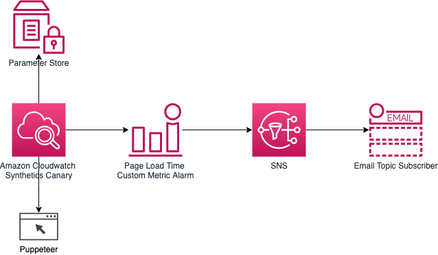

# Using Amazon Cloudwatch Synthetics to measure page load time
The purpose of this repository is to demonstrate how Amazon Cloudwatch Synthetics can be used to measure the page load time.
Having a low page load time is critical for startups because organic traffic is a very important source of traffic. Page ranking algorithms from search engines penalize pages with high load times. We can provide a solution to measure page load time and alert when it surges above a threshold using [Amazon Cloudwatch Synthetics](https://docs.aws.amazon.com/cdk/api/latest/docs/aws-synthetics-readme.html) and a custom metric. From this metric we can create alarms and with SNS we can send the alarm by email. The solution can be easily extended to monitor multiple pages or send alerts using other means such as Slack with [AWS Chatbot](https://docs.aws.amazon.com/chatbot/index.html).

## Requirements

* Node.js 12 or above
* npm 6 or above
* [AWS CDK](https://docs.aws.amazon.com/cdk/latest/guide/getting_started.html#getting_started_install). It requires you to set AWS credentials so that it can make calls to AWS services on your behalf.
* Set the AWS region you want to deploy this application to. You can do so through `aws configure` or `AWS_DEFAULT_REGION` environment variable.

## Creating the infrastructure

The application is implemented as a CDK application. When deploying, two configuration parameters are needed: the email that will be subscribed to the alarm topic and the URL of the page to be monitored.

* `npm install` - bootstrap.
* `cdk deploy --parameters subscriptionEmail="youremail@example.com" --parameters pageLoadTimeURL="https://www.example.com"` 

## Architecture

The application creates a Synthetics Canary with the page load blueprint. A metric with the page load time is created, and an alert will be monitoring this metric and will be activated when the page load time surges above a threshold.



##  Clean up
Destroy the CDK Stack:
Ensure you are in the cdk directory and then run the below command:

```bash
cdk destroy
```
## Security

See [CONTRIBUTING](CONTRIBUTING.md#security-issue-notifications) for more information.

## License

This library is licensed under the MIT-0 License. See the LICENSE file.
